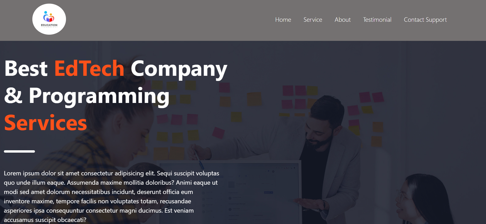
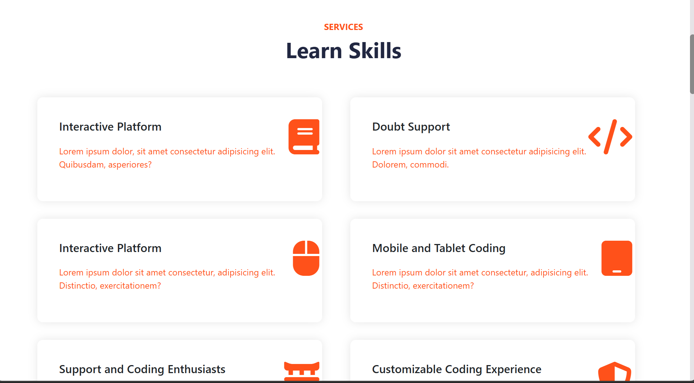
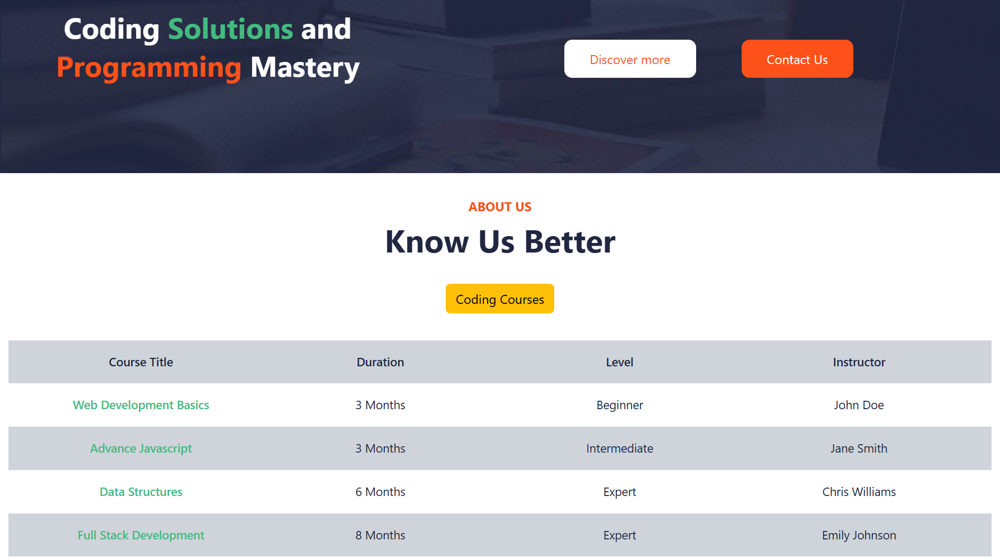
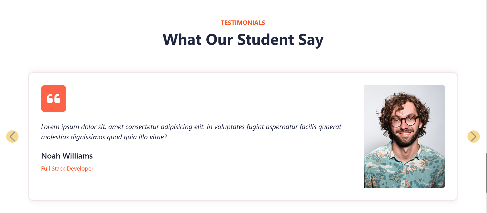
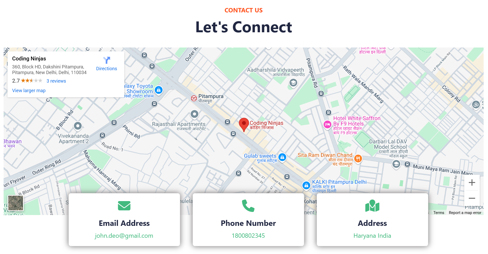
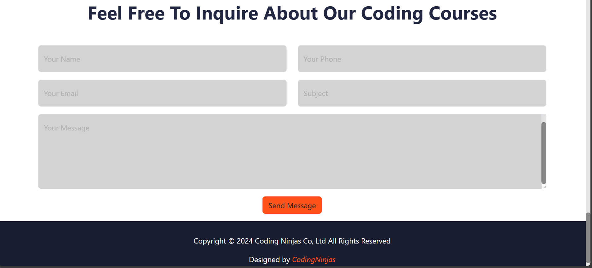

# Ed-Tech Capstone Project

This project is a **responsive Ed-Tech website** built using **HTML and CSS**. It is designed to be fully adaptable to different screen sizes, ensuring a seamless user experience on desktops, tablets, and mobile devices.

## Features
- ✅ **Basic HTML & CSS** for easy understanding and customization
- ✅ **Fully responsive** using Flexbox and Media Queries
- ✅ **Clean and modern UI** suitable for an educational platform
- ✅ **Multiple sections**: Home, Courses, About Us, Contact Us

## Technologies Used
- **HTML5** for structuring the web pages
- **CSS3** for styling and responsiveness
- **Flexbox & Media Queries & Bootstrap** for a mobile-friendly design

## Output

